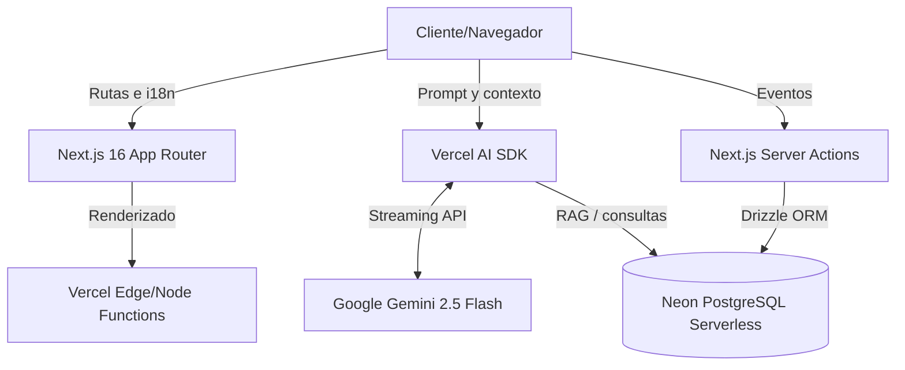

## 0. Ficha del proyecto

### **0.1. Tu nombre completo:**

Javier Álvarez García

### **0.2. Nombre del proyecto:**

AI-Powered Developer Portfolio & Productivity Hub

### **0.3. Descripción breve del proyecto:**

Un portfolio interactivo E2E que trasciende el concepto clásico de currículum. Actúa como un hub de herramientas para desarrolladores y está potenciado por un Agente de IA "Context-Aware" capaz de asistir a reclutadores, explicar la arquitectura del proyecto y recomendar contenido dinámico (RAG) consumiendo una base de datos serverless.

### **0.4. URL del proyecto:**

TENGO QUE AÑADIR LA URL CUANDO HAGA DEPLOY DEFINITIVO

### **0.5. URL o archivo comprimido del repositorio**

https://github.com/javierallvarez/portfolio-2026

---

## 1. Descripción general del producto

### **1.1. Objetivo:**

El propósito de este producto es doble. Por un lado, sirve como una demostración técnica viva (Proof of Work) de mis capacidades como Software Engineer especializado en productividad y herramientas internas. Por otro, soluciona la fricción habitual en los procesos de selección mediante un Agente de IA que permite a los reclutadores hacer preguntas en lenguaje natural sobre mi experiencia, reduciendo la carga cognitiva de leer un documento estático.

### **1.2. Características y funcionalidades principales:**

- **Context-Aware AI Agent:** Un chatbot (construido con Vercel AI SDK y Gemini) que lee el `pathname` actual de la URL para ofrecer respuestas contextualizadas sobre la sección que el usuario está visitando.
- **Vinyl Sommelier (RAG):** Usamos la API de Discogs. Un sistema de recomendación que utiliza _Retrieval-Augmented Generation_. La IA filtra y recomienda vinilos leyendo directamente de una base de datos PostgreSQL, garantizando que no existan alucinaciones sobre el stock.
- **Developer Utilities Hub:** Herramientas de uso diario (JWT Decoder, Cron Translator, Password Generator, JSON Formatter) procesadas de forma segura 100% en el cliente (navegador).
- **Página CV (`/cv`):** Currículum formal con foto, experiencia y stack; optimizada para imprimir o guardar como PDF desde el navegador.
- **Telemetría integrada:** Sistema de recolección de eventos (Server Actions) que registra el uso de las herramientas en la base de datos de forma anónima.
- **Internacionalización (i18n):** Arquitectura multi-idioma (ES/EN) soportada nativamente mediante enrutamiento dinámico (`app/[lang]`) y middleware.

### **1.3. Diseño y experiencia de usuario:**

La interfaz sigue una filosofía _Developer-First_ y _Mobile-Second_ (priorizando la visualización de arquitectura en escritorio, pero manteniendo total funcionalidad en móvil).

- **Command Palette (Cmd+K):** Navegación rápida mediante teclado, emulando la experiencia de un IDE.
- **Accesibilidad (a11y) como base:** Soporte de navegación por teclado, gestión estricta de foco (ARIA, `aria-activedescendant` en la paleta) y paleta clara suavizada para contraste.
- **Anti-flashbang en modo claro:** Tokens de tema suavizados en claro para reducir fatiga visual frente al blanco puro por defecto.

### **1.4. Instrucciones de instalación:**

1. Clonar el repositorio: `git clone https://github.com/javierallvarez/portfolio-2026.git`
2. Instalar dependencias: `npm install`
3. Configurar variables de entorno copiando `.env.example` a `.env` o `.env.local` (según tu flujo con Next.js):
   - `DATABASE_URL` (conexión a Neon PostgreSQL)
   - `GOOGLE_GENERATIVE_AI_API_KEY` (clave de Gemini para el chat y el sommelier)
   - Resto de claves indicadas en `.env.example` (Clerk, Discogs, Upstash, etc.) si usas esas funciones
4. Inicializar la base de datos: `npm run db:push`
5. Levantar servidor local: `npm run dev`

---

## 2. Arquitectura del Sistema

### **2.1. Diagrama de arquitectura:**

La aplicación sigue una arquitectura _serverless_ / _edge_ orientada a componentes, utilizando Server Components y Server Actions de React para minimizar el JS en el cliente.



**Justificación técnica:** la arquitectura sigue un enfoque _spec-driven_ y _AI-native_, priorizando latencia baja y coste predecible:

- **Next.js 16 y Server Components:** desplazan renderizado al servidor o al _edge_, reducen el coste de hidratación en cliente y mejoran el SEO de forma nativa.
- **Vercel AI SDK:** gestiona el ciclo de vida del _streaming_ de LLM (Gemini 2.5 Flash) con una API estable en React, sin bloquear la UI.
- **Neon (PostgreSQL serverless):** base de datos gestionada con _scale-to-zero_ y flujo de trabajo compatible con ramas de desarrollo; encaja con despliegues frecuentes y entornos efímeros.
- **Drizzle ORM:** capa delgada y tipada frente a ORMs más pesados; encaja bien con funciones serverless y _edge_ en Vercel.

### **2.2. Stack tecnológico**

| Tecnología         | Versión / herramienta            | Propósito en el proyecto                                            |
| :----------------- | :------------------------------- | :------------------------------------------------------------------ |
| **Framework base** | Next.js 16 (App Router)          | Orquestación, SSR, Server Components e i18n nativo.                 |
| **IA / LLM**       | Vercel AI SDK + Gemini 2.5 Flash | Agentes de IA con _streaming_, RAG y conciencia de contexto.        |
| **Base de datos**  | Neon (PostgreSQL serverless)     | Telemetría y corpus para RAG.                                       |
| **ORM**            | Drizzle ORM                      | Acceso a datos _typesafe_ y ligero para entornos serverless / edge. |
| **Estilos y UI**   | Tailwind v4 + HeroUI             | Sistema de diseño accesible, responsivo y modo oscuro.              |
| **Testing**        | Playwright                       | Suite E2E y validación de flujos críticos en CI.                    |

### **2.3. Estructura del proyecto**

La organización de ficheros sigue el patrón modular del App Router, separando la lógica de servidor de los componentes de cliente.

```text
├── app/
│   ├── [lang]/             # Rutas dinámicas con i18n nativo (ES/EN)
│   │   ├── cv/             # Página de CV (printable engine)
│   │   ├── tools/          # Developer Utilities Hub
│   │   └── interactive-lab/  # Laboratorio de IA (Sommelier)
│   └── api/                # Route Handlers para streaming de IA
├── components/             # UI organizada por dominio
│   ├── ai/                 # Chatbot y componentes RAG
│   ├── layout/             # Navbar, Command Palette y Footer
│   └── tools/              # Utilidades cliente (JWT, Cron, etc.)
├── actions/                # Server Actions (telemetría y DB)
├── dictionaries/           # Literales i18n (es.json, en.json)
├── lib/                    # IA, i18n, knowledge base, utilidades
│   └── db/                 # Esquema Drizzle y conexión a Neon
└── tests/                  # Suite E2E con Playwright
```

### **2.4. Metodología de desarrollo asistido por IA (sistema JAG)**

Para este proyecto se ha definido el **flujo JAG** (acrónimo de **J**avier **Á**lvarez **G**arcía), un proceso iterativo en cuatro etapas orientado a que el código asistido por IA cumpla estándares de calidad y seguridad.

1. **Spec (ticket JAG):** definición de la funcionalidad mediante un ticket técnico con criterios de aceptación (AC) claros (p. ej. en `specs/JAG-XXX-*.md`).
2. **AI prompting (contextual):** inyección de la especificación en el asistente (Cursor, Claude, etc.) con reglas de arquitectura explícitas (Server Components, seguridad en cliente).
3. **Human gate (validación):** revisión manual obligatoria de accesibilidad (ARIA), datos sensibles e i18n antes de integrar.
4. **Merge y telemetría:** integración en la rama principal y comprobación de telemetría en desarrollo cuando aplica.
5. **Database branching (Neon):** el desarrollo de esquemas puede apoyarse en ramas de base de datos efímeras alineadas con la rama de Git, para probar migraciones de Drizzle sin riesgo sobre datos de producción antes del _merge_ final.

### **2.5. Definition of Done (DoD)**

Ninguna funcionalidad se considera terminada (_Done_) hasta cumplir estos _gates_ de calidad:

- **Linting y tipos:** `npm run lint` y `npm run type-check` (`tsc --noEmit`) sin errores.
- **Accesibilidad:** navegable por teclado y etiquetas ARIA coherentes con el patrón del componente.
- **Responsividad:** validado en escritorio y móvil (con aviso de “desktop recommended” donde aplique).
- **i18n:** literales extraídos a `dictionaries/es.json` y `dictionaries/en.json`.
- **Modo oscuro:** colores y contraste correctos al cambiar de tema.

### **2.6. Infraestructura, seguridad y tests**

- **CI/CD:** GitHub Actions (`.github/workflows/ci.yml`) y despliegue en Vercel (u host compatible con Next.js).
- **Seguridad en cliente:** JWT, generador de contraseñas, etc. operan 100% en el navegador; los datos sensibles no se envían al servidor para esas operaciones.
- **Tests E2E:** Playwright en `tests/e2e/smoke.spec.ts` (navegación, rutas clave, paleta de comandos, _viewports_ de CI).

## 3. Modelo de Datos

La persistencia de datos se maneja a través de **Neon (PostgreSQL Serverless)** utilizando **Drizzle ORM**. El modelo está diseñado para ser ligero, eficiente y centrado en dos dominios principales: analítica de uso (Telemetría) y el recomendador RAG (Vinilos).

### **3.1. Tabla: `telemetry_events`**

Registra de forma anónima las interacciones de los usuarios con las herramientas del _Utilities Hub_ para poblar el dashboard en tiempo real de la sección _Under the Hood_.

| Columna      | Tipo        | Restricciones                            | Descripción                                                                  |
| :----------- | :---------- | :--------------------------------------- | :--------------------------------------------------------------------------- |
| `id`         | `uuid`      | PRIMARY KEY, Default `gen_random_uuid()` | Identificador único del evento.                                              |
| `event_type` | `varchar`   | NOT NULL                                 | Tipo de evento (ej: `jwt_decoded`, `cron_translated`, `password_generated`). |
| `metadata`   | `jsonb`     |                                          | Información adicional anónima del evento (opcional).                         |
| `created_at` | `timestamp` | NOT NULL, Default `now()`                | Fecha y hora de la ejecución del evento.                                     |

### **3.2. Tabla: `vinyls`**

Almacena la colección de discos físicos importada desde Discogs. Actúa como el corpus de conocimiento (Knowledge Base) para que el Agente de IA (Vinyl Sommelier) realice _Retrieval-Augmented Generation_ (RAG).

| Columna      | Tipo        | Restricciones                            | Descripción                            |
| :----------- | :---------- | :--------------------------------------- | :------------------------------------- |
| `id`         | `uuid`      | PRIMARY KEY, Default `gen_random_uuid()` | Identificador único en nuestra DB.     |
| `discogs_id` | `integer`   | UNIQUE                                   | ID de referencia de la API de Discogs. |
| `title`      | `varchar`   | NOT NULL                                 | Título del álbum.                      |
| `artist`     | `varchar`   | NOT NULL                                 | Nombre del artista o grupo.            |
| `year`       | `integer`   |                                          | Año de lanzamiento de la edición.      |
| `cover_url`  | `varchar`   |                                          | URL de la imagen de portada.           |
| `created_at` | `timestamp` | NOT NULL, Default `now()`                | Fecha de registro en el sistema.       |

### **3.3. Principios de diseño: normalización e índices**

El diseño de la base de datos combina infraestructura serverless con rigor relacional (modelo entidad–atributo alineado con Codd) para preservar integridad y consultas predecibles.

**Normalización (hasta 3FN)**

- **1FN:** cada tabla tiene clave primaria única (`id` tipo `uuid`) y valores atómicos por columna.
- **2FN:** los atributos no clave dependen por completo de la clave primaria (no hay grupos repetitivos parcialmente dependientes de una clave compuesta artificial).
- **3FN:** se evitan dependencias transitivas; la colección de vinilos y los eventos de telemetría viven en tablas separadas, de modo que un cambio en metadatos de un disco no obliga a reescribir filas de log de uso de forma redundante.

**Optimización de consultas**

- **Índices B-Tree:** sobre columnas de filtrado frecuente (p. ej. `discogs_id` en catálogo RAG, `event_type` en telemetría) para favorecer _Index Scan_ frente a _Sequential Scan_ en el laboratorio interactivo y en el dashboard de _Under the Hood_.
- **Carga de trabajo:** lecturas dominantes en telemetría (agregaciones por tipo de evento) y selección acotada de vinilos para contexto del Sommelier.

---

## 4. Especificación de la API

Aunque la aplicación utiliza fuertemente Server Actions para la mutación de datos, los Agentes de Inteligencia Artificial se exponen a través de **Route Handlers** (API RESTful) para poder utilizar la funcionalidad de _Streaming_ del Vercel AI SDK.

### **4.1. `POST /api/chat` (Context-Aware Agent)**

Endpoint principal que sirve al chatbot flotante del portfolio.

- **Headers:** `Content-Type: application/json`
- **Body:**

```json
{
  "messages": [{ "role": "user", "content": "Pregunta del usuario" }],
  "currentPath": "/es/tools"
}
```

**Lógica:** el backend inyecta dinámicamente `currentPath` en el _system prompt_ para que el modelo sepa en qué página está el visitante y ajuste la respuesta al contexto.

**Respuesta (200 OK):** `text/event-stream` (fragmentos de texto generados por Gemini).

### **4.2. `POST /api/sommelier` (RAG Agent)**

Endpoint del recomendador de vinilos del _Interactive Lab_.

- **Runtime:** `edge` (en el código se prioriza evitar _buffering_ en el streaming con Gemini en Vercel).
- **Headers:** `Content-Type: application/json`
- **Body:**

```json
{
  "messages": [{ "role": "user", "content": "Quiero algo para relajarme en la playa" }]
}
```

**Lógica:** se consulta la tabla `vinyls` y el resultado se inyecta como contexto en el prompt al LLM. Los _safety settings_ del modelo usan `BLOCK_NONE` en las categorías configuradas para reducir falsos positivos al procesar letras, nombres de artistas u otra copia benigna relacionada con vinilos.

**Respuesta (200 OK):** `text/event-stream`.

---

## 5. Historias de usuario

Se han definido cuatro historias _must-have_ (núcleo del flujo E2E) y dos _should-have_ (diferenciadores de UX), desde la idea hasta la implementación.

### **5.1. Must-have (flujo principal)**

- **AI Chatbot contextual:** como _Technical Recruiter_, quiero conversar con un agente de IA que entienda en qué página del portfolio estoy, para hacer preguntas concretas sobre la arquitectura mostrada sin aportar contexto extra.
- **Vinyl Sommelier (RAG):** como visitante, quiero describir mi estado de ánimo en el laboratorio interactivo, para que la IA recomiende un disco real de la colección sin inventar inventarios.
- **Developer tools seguras:** como _Software Engineer_ visitante, quiero decodificar un JWT o traducir un _cron_ de forma segura, para valorar la capacidad técnica sabiendo que mis datos sensibles no salen del navegador.
- **Internacionalización nativa:** como usuario global, quiero leer el portfolio en español o inglés con URLs compartibles (`/es` o `/en`), para entender la documentación técnica en mi idioma.

### **5.2. Should-have (UX y pulido)**

- **CV imprimible:** como _Hiring Manager_, quiero generar un PDF impecable con **Cmd+P** en la ruta `/cv`, para adjuntarlo al ATS de mi empresa sin perder la maquetación.
- **Command Palette:** como _power user_, quiero navegar con un menú abierto por atajo (**Cmd+K**), para moverme por el portfolio con la misma fluidez que en el IDE.

---

## 6. Tickets de trabajo (flujo JAG-001 a JAG-018)

El trabajo se descompone en tickets con prefijo **JAG** y especificación en `specs/JAG-XXX-*.md`. La tabla resume la evolución por fases (rangos alineados con el tablero del máster; el repositorio puede contener un subconjunto concreto de especificaciones en cada momento).

| Fase                       | Tickets JAG       | Foco principal                                                                                                                         |
| :------------------------- | :---------------- | :------------------------------------------------------------------------------------------------------------------------------------- |
| **Fase 1 — Fundación**     | JAG-001 … JAG-007 | Arquitectura del App Router, configuración de base de datos (Neon + Drizzle), identidad visual y UI base.                              |
| **Fase 2 — Núcleo IA**     | JAG-008 … JAG-012 | Agente de chat **context-aware** (_streaming_ con Gemini), laboratorio RAG (Vinyl Sommelier), utilidades y telemetría ligadas a la IA. |
| **Fase 3 — UX y escalado** | JAG-014 … JAG-016 | Refactor de internacionalización, pulido de UI móvil y refuerzo de accesibilidad (teclado, ARIA, contraste).                           |
| **Fase 4 — Pulido final**  | JAG-018           | Motor de CV imprimible (`/cv`), estilos `print:` y refinamiento del _hero_ y rutas críticas.                                           |

Los **prompts representativos** usados junto a este flujo están recogidos en [`prompts.md`](./prompts.md).

---

## 7. Pull requests y control de versiones

### **7.1. Estrategia de ramas**

- **Funcionalidades y tickets JAG:** ramas `feat/JAG-XXX-descripcion-corta` (una rama por ticket o por entrega acotada).
- **Correcciones:** ramas `fix/JAG-XXX-descripcion` o `fix/descripcion` cuando el arreglo no está ligado a un ticket numerado.

Los cambios se integran en **`main`** (o en `develop` si el equipo usa ramas de integración) solo vía **pull request**, nunca con _push_ directo a producción.

### **7.2. Proceso de revisión**

Cada PR incluye:

- **Descripción detallada:** contexto, enfoque técnico, enlace al spec (`specs/JAG-XXX-*.md`) y sección opcional de transparencia sobre uso de IA.
- **Human Gate:** checklist en la plantilla [`.github/PULL_REQUEST_TEMPLATE.md`](./.github/PULL_REQUEST_TEMPLATE.md) (revisión línea a línea del código asistido por IA, implicaciones de seguridad, tests verificados).
- **CI obligatorio:** el pipeline (`.github/workflows/ci.yml`) debe quedar en verde antes del _merge_: **ESLint**, **Prettier** (`format:check`), **`npm run type-check`**, **`npm run build`** y pruebas **E2E con Playwright** cuando apliquen al cambio.

### **7.3. Commits**

Se sigue una convención inspirada en **Conventional Commits** (`feat:`, `fix:`, `refactor:`, `docs:`, `chore:`, etc.) para mantener un historial legible y facilitar _changelogs_ y revisiones.

---

## 8. Futuros pasos y lecciones aprendidas

### **8.1. Lecciones aprendidas**

- Combinar **especificación escrita** (JAG) con **prompts acotados** reduce deriva del modelo y acelera la revisión humana.
- Tratar **accesibilidad, i18n y modo oscuro** como requisitos desde el primer _merge_, no como repaso final, evita retrabajo costoso.

### **8.2. Futuros pasos**

- Explorar la transición hacia un **orquestador multiagente** (p. ej. agente de planificación + agente de código + agente de revisión) manteniendo trazabilidad y límites de coste.
- Valorar **embeddings vectoriales en el _edge_** (o servicio dedicado) para enriquecer el RAG más allá de la recuperación tabular actual, con políticas claras de privacidad y latencia.

---
